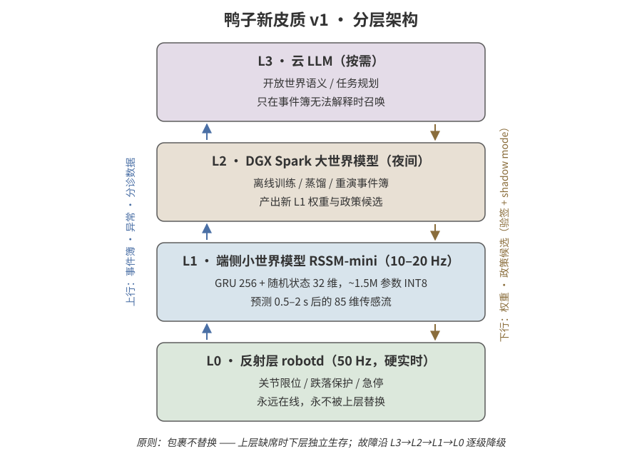
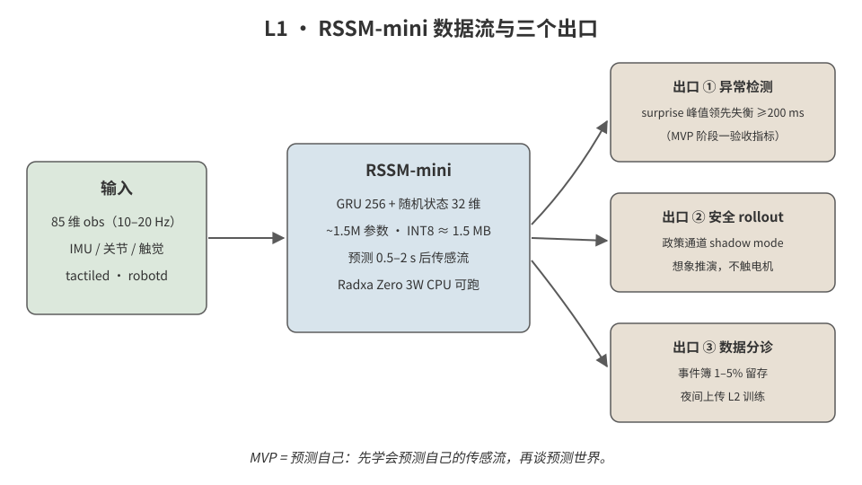
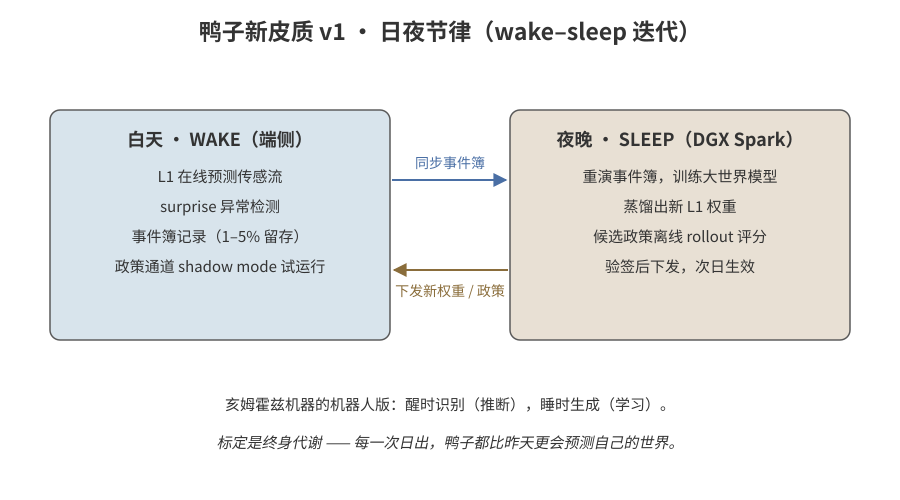

# 鸭子新皮质 · 设计 v1

> 动机：从《智能简史》对账得出的需求单——表 11.1「预测的进化」第三行（预测所有感觉数据）在鸭子身上尚无对应器官。本文定义这个器官的 v1 架构：边缘-云端分工、日夜迭代节律、与既有 robotd/tactiled/政策通道的接口。
> 日期：2026-10-02
> 状态：提案（未实施）
> 修订记录：v1.1（2026-10-03）——§8 新增开放问题 #5（事件簿回放优先级）与 #6（ICL 海马体化换心路径），附录谱系表同步补行。

---

## 0. 一页摘要

鸭子目前只有两级智能：robotd 反射层（PPO 策略，50Hz）+ 云端 LLM（任务语义）。中间缺一个**持续预测自身感觉流的世界模型**——本设计补上这一层：

- **L1 新皮质芽**：端侧 Radxa Zero 3W 上跑一个 Dreamer 式迷你 RSSM（约 1.5M 参数，INT8），以 10–20Hz 预测未来 0.5–2 秒的 85 维传感流；预测误差（surprise）驱动三件事——异常检测、安全 rollout、数据分诊；
- **L2 大世界模型**：DGX Spark 夜间离线训练，做长时程想象与策略演练，蒸馏回端侧；
- **日夜节律**：白天生活+记录惊奇，夜里充电时回传事件簿→云端做梦→蒸馏下放→政策通道验签+shadow mode 放量。端侧=海马体（快记），云端=新皮质（慢固化）。

MVP 只做一件事：**预测 2 秒后的自身传感流**——与五亿年前鱼类的第一个世界模型同构：先预测自己，再长出物体，再长出他者。

## 1. 设计原则（需求单）

来自《智能简史》第 9–11 章对账（详见 a-brief-history-of-intelligence 仓 Session 01–06）：

1. **预测一切感觉流，而非只预测奖励**——奖励稀疏、感觉稠密；为未知的未来任务买保险（稠密自监督）；
2. **持续预跑，比实时快**——预测不是按需服务，是永远在线的后台进程；
3. **误差加权**——保真是可分配的预算，相关性决定权重（注意力=误差权重分配器）；
4. **包裹不替换**——新层不淘汰旧层，旧层成为新层的执行器与降级序列；
5. **梦只用于筛选，确认必须真碰世界**——想象评估出的策略必须经现实抽检（shadow mode）才能放量；
6. **好奇心必须有上限**——surprise 驱动的探索奖励设衰减与封顶，不得压倒生存奖励（温度/能量）。

## 2. 分层架构

| 层 | 位置 | 频率 / 视野 | 预测什么 | 生物对应 |
|---|---|---|---|---|
| L0 反射层 | robotd（端） | 50Hz+ / <0.5s | 姿态、接触、滑移（PPO 策略 + 皮肤反射） | 脊髓/脑干 |
| **L1 新皮质芽** | 端侧 RK3566 | 10–20Hz / 0.5–2s | 下一秒自身感觉流（85 维 obs + IMU） | 鱼的内侧皮质 |
| L2 大世界模型 | DGX Spark（家） | 离线 / 长时程 | 情景 rollout、策略演练与评估 | 哺乳动物新皮质 |
| L3 语义层 | 云/手机 LLM | 秒级 / 任务 | 目标条件化下发（想要什么） | 前额叶/语言区 |

**切分依据是预测的时间尺度，不是算力**：每层的存在理由是它独有预测视野——低层看不到远处，高层来不及看近处。

## 3. L1 新皮质芽：端侧小世界模型

### 3.1 模型规格（RSSM-mini）

| 项 | 规格 | 说明 |
|---|---|---|
| 输入 | 85 维 obs（本体+皮肤）+ IMU +（阶段三）低维视觉 embedding | 不预测像素，预测感觉流本身 |
| 编码器 | 2 层 MLP → 128 维 | 压到隐状态 |
| 动力学 | GRU 256 维 + 随机状态 32 维 | s_{t+1} = f(s_t, a_t)，Dreamer RSSM 迷你版 |
| 预测头 | obs 重建 + 生存变量（温度/电量） | 重建即监督 |
| 参数量 | ≈1.5M | FP32 6MB / INT8 1.5MB |
| 推理开销 | ≈1–2 MFLOPs/step | RK3566 四核 A55 CPU 即可 20Hz，NPU 可选 |
| 内存预算 | <100MB | 与 robotd 共存于 1GB RAM |
| 功耗预算 | +0.2–0.4W | 与皮肤项目同级（整机 +3.8% 重量、+0.4W 先例） |

### 3.2 三个出口（预测误差的用途）

1. **异常检测**：高 surprise → 触发 L0 反射介入（"脚下没有预期中的地面"的机器人版）；
2. **安全 rollout**：动作下发前隐空间预演 2 秒——"这一步会摔吗"，超出安全包线则否决/减速；
3. **数据分诊**：高误差片段写入**惊奇事件簿**（夜间优先上传）——数据便宜答案贵的物理实现。

### 3.3 数据量估算

85 维 × 20Hz × float32 ≈ 6.8KB/s ≈ 560MB/天（全量）；事件簿只保留高误差片段（1–5% 留存）→ 每天数十 MB，充电时 WiFi 回传无压力。

## 4. 日夜节律：wake-sleep 迭代循环

| 阶段 | 动作 | 要点 |
|---|---|---|
| 白天 wake | 端侧栈生活，L1 持续预测+记录 | 只记录，不训练（端侧不做反向传播） |
| 夜间回传 | 充电时 WiFi 同步事件簿 | 高误差片段优先；断网可累积本地 |
| 云端做梦 | DGX Spark 训练大世界模型 + imagination 内练策略 | GB10 ARM64 环境按既有 Isaac Lab 经验（headless、本地资产） |
| 梦里评估 | 模型内策略评估 | 梦只用于筛选；通过者进入 shadow 候选 |
| 蒸馏下放 | 小策略 + 小世界模型打包 | 教师-学生蒸馏，端侧规格见 §3.1 |
| OTA 放量 | 政策通道：验签 → shadow mode（新旧并行、只比较不执行）→ 偏差达标才正式启用 | 单向门不靠模型自觉 |

这是互补学习系统的机器人版：**端侧=海马体（快记事件），云端=新皮质（慢固化进权重）**——harness→model 的批量蒸馏通路，鸭子自己长一条。

## 5. 降级序列与故障矩阵

| 故障 | 行为 | 依据 |
|---|---|---|
| 网络断 | L2/L3 离线，L1+L0 自治保底 | 降级不是设计出来的优雅，是考古层显形 |
| L1 崩溃/看门狗超时 | 纯 L0 PPO 反射兜底 | 反射层永远可独立运行 |
| L1 模型陈旧（surprise 持续升高） | 自动降权 WM 输出，反射层优先，请求夜间重训 | 模型陈旧 ≡ 世界变了，不是鸭子坏了 |
| 皮肤传感器坏 | 误差计对失效通道打掩码，不污染全局 surprise | 局部故障不升级为全局幻觉 |

**不变量：任何单点失效后，鸭子永远退到"更老一层"，永远不存在无脑状态。**

## 6. MVP 路线图

- **阶段一（4–6 周）**：85 维 obs 自预测 WM。先在 Spark 上用既有日志离线训练，端侧**只读模式**部署（只输出 surprise 不介入控制），收集误差分布基线；
- **阶段二**：surprise 接入反射介入 + 事件簿上传 + 夜间再训练闭环跑通（wake-sleep 全循环第一次转起来）；
- **阶段三**：加低维视觉特征（小 CNN INT8 embedding）→ 大世界模型上线 → imagination 内策略微调纳入闭环。

验收标准（阶段一）：对"抽走脚下支撑面"类事件，surprise 峰值领先机器人实际失衡 ≥200ms。

## 7. 与既有系统的接口

- **robotd**：surprise 信号经 JSON-RPC/Unix socket 订阅（同 tactiled 先例），不侵入控制主环；
- **tactiled**：皮肤特征包（12×12→CoP 等）作为 obs 的组成部分进入 L1 编码器；
- **政策通道**：L1/L2 蒸馏产物复用既有验签+沙箱通道分发，shadow mode 作为新政策类型的默认入口；
- **obs**：沿用皮肤项目扩维后的 85 维定义，视觉特征作为可选追加段。

## 8. 风险与开放问题

1. **梦里评估的信任度**：RoboWorld 的 r=0.989 在其训练分布内成立；鸭子的梦会漂——shadow mode 的现实抽检率定多少，待实验；
2. **好奇心上限的量化**：surprise 奖励的衰减曲线与封顶值需要实机调参（原则已定：不得压倒温度/电量生存奖励）；
3. **事件簿的隐私与带宽**：家庭环境下视频特征是否上传需分级（默认只上传低维特征，不上传原始图像）；
4. **政策通道的包大小限制**：WM 蒸馏包是否超出现有通道设计载荷，待查 robotd 政策通道文档。
5. **事件簿的回放优先级（v1.1 新增）**：生物海马体的回放不是均匀抽样，而是按情绪/奖励标记加权——恐惧与奖赏经历的回放频次显著更高。当前事件簿是被动分诊、夜间均匀重演，浪费了出口①已有的信号。候选方案：L1 写入事件簿时直接用 surprise 值打优先级标签（零新增机制），夜间 L2 训练按优先级加权采样。待阶段二闭环跑通后评估收益。
6. **ICL 海马体化的换心路径（v1.1 新增）**：当前 LLM 的 in-context learning 只有海马体的读取面（上下文 buffer），缺三样原语——快速持久写入、主动回放调度、固化后移交。鸭子在系统层已用「事件簿 + 日夜节律」补齐这三样；待模型层的快速权重 / 持久记忆模块成熟后，可直接替换 L1/L2 的内部实现，系统接口（事件簿格式、日夜节律、政策通道）保持不变。架构原则：**器官接口先于器官实现收敛**——系统层先把海马体的生态位占住，模型层成熟一个换一个。

## 附录 · 概念谱系对照

| 本文概念 | 神经科学对应 | 出处 |
|---|---|---|
| L1 小世界模型 | 内侧皮质/海马体（第一个世界模型） | 智能简史第 9 章 |
| 预测感觉流 | 新皮质=现实世界预测机器（表 11.1 第三行） | 第 11 章 |
| surprise 三出口 | 预测误差上报（意识=残差显示器） | 第 11 章 |
| 日夜节律 | wake-sleep 算法 / 互补学习系统 | 第 11 章 |
| shadow mode 放量 | 梦只用于筛选，确认真碰世界 | 讨论结晶 #39 |
| 降级序列 | 包裹不替换 / 故障模式分层 | 讨论 Session 02 |
| 事件簿回放优先级（v1.1） | 海马体按情绪/奖励标记加权回放 | 第 12 章·情景记忆回放 |
| 事件簿+日夜节律（系统层记忆） | 海马体三原语：写入/回放/移交 | 第 12 章 + Session 07 讨论 |
