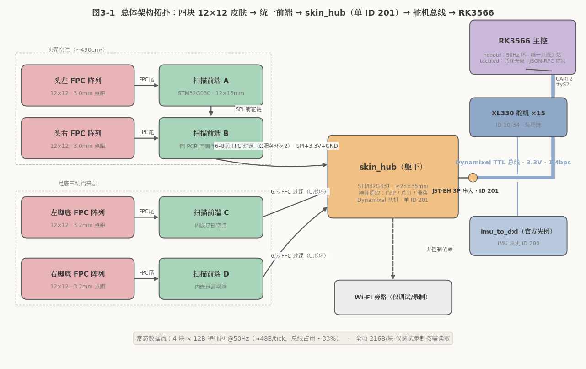
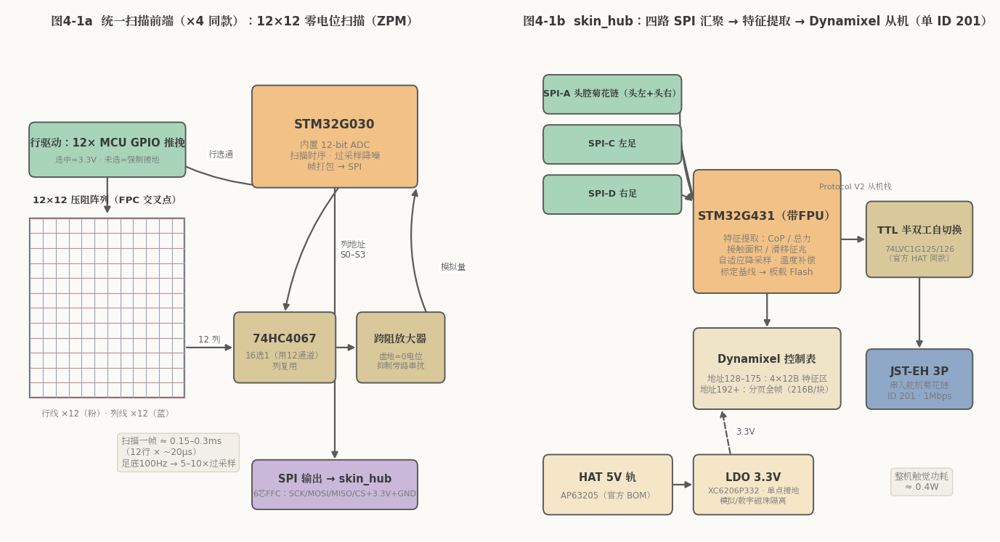
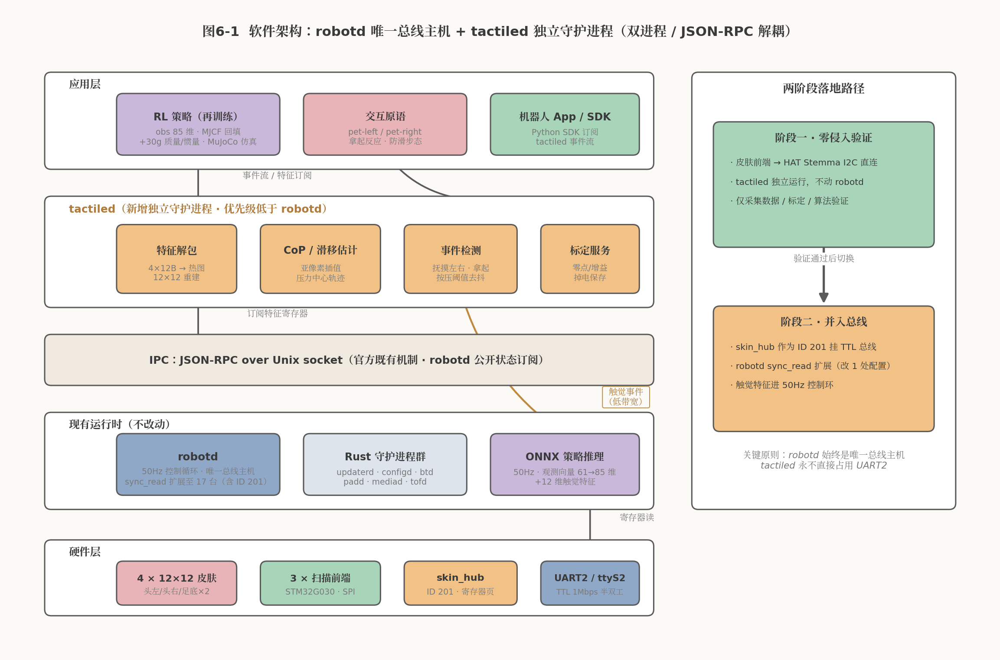
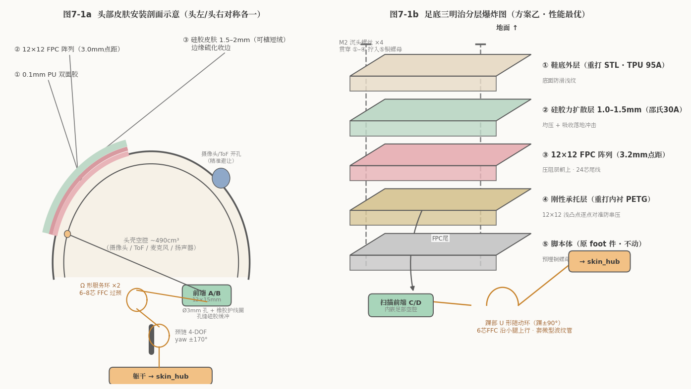

# MicroDuck 电子皮肤部署方案（终版 · 全机 12×12）

**主题**：在 Pollen Robotics MicroDuck 双足机器人上部署 **4 块 12×12 = 144 点压阻式电子皮肤**（头左、头右、左脚底、右脚底）的完整工程方案——硬件架构、电路设计、通讯接入、安装固定、软件集成与实施路线。

**事实基线**：MicroDuck 官方开源仓库（`pollen-robotics/microduck`、`microduck_rl`、`elec_RPI_Robot_HAT`，Apache-2.0，代码即规格书）+ 官网 / Press kit。日期：2026-09-02。

---

## 一、硬件基线（方案设计依据）

| 项目 | 事实 | 证据 |
|---|---|---|
| 主控 | Radxa Zero 3W（**RK3566**，4×Cortex-A55 + 0.8 TOPS NPU，1GB RAM），Armbian 系统 | 官方设备树 `compatible = "radxa,zero-3w","rockchip,rk3566"` |
| 控制环 | **50 Hz**，RL 策略 ONNX 板载推理，机器人完全自治 | 官方 README / robotd 设计文档 |
| 舵机 | ROBOTIS **Dynamixel XL330 ×15**（腿 10-14/20-24、颈头嘴 30-34） | `duck-control/src/model.rs` |
| 舵机总线 | **Dynamixel Protocol V2，TTL 半双工 3.3V 逻辑，1 Mbps**，接 UART2（/dev/ttyS2）；单总线 16 设备菊花链 | `bus.rs`（`.with_protocol_v2()`、`BAUD_RATE = 1_000_000`） |
| **总线先例** | 官方自制 `imu_to_dxl` 板（LSM6DSV16X）以 **Dynamixel 从机 ID 200** 与舵机同总线、同 sync_read 读出 | robotd 设计文档 §1.1 拓扑图、`imu.rs` |
| 总线负载 | 每 tick sync_write + sync_read 合计约 5ms / 20ms，**占用约 25%** | 按报文长度推算（sync_read 16 设备 ×12B） |
| 电源 | NP-F550 2S 电池（带载 **6.6–8.2V**）直供舵机；自制 HAT 板含 5V 降压（AP63205）供逻辑 | `model.rs`、`elec_RPI_Robot_HAT` BOM |
| 可用扩展口 | ①舵机总线 JST-EH 3P 菊花链续接；②HAT 上 Stemma J5（I2C 400kHz，现接头部 ToF 0x29）。40 针排针已被 HAT 整板占用，无文档化空闲 GPIO/SPI | `i2c3-pihat.dts`、全仓检索 |
| 结构 | 头壳为空心壳体（约 92×123×46mm，内腔约 490cm³，装摄像头/ToF/麦克风/扬声器）；**鞋底为独立可拆件**（41×54×13mm，官方 STL 公开可改模）；踝 ±90°、head_yaw ±170°；整机 <800g、25cm、M2 螺丝体系 | `microduck_rl` STL 网格实测 |

**方案的三个设计支点**：①总线有官方非舵机从机先例（ID 200），皮肤可同法接入；②TTL 3.3V 逻辑与传感系统天然电平兼容；③50Hz 控制环是整机生命线，任何扩展不得挤压其总线与算力预算。

---

## 二、传感规格（全机统一 12×12 模块）

| 位置 | 阵列 | 点距 / 有源区 | 帧率策略 | 布置 |
|---|---|---|---|---|
| 头左 / 头右 | 12×12 = 144 点 ×2 | 3.0mm / 36×36mm | 30–50Hz 常开 | **左右对称贴头壳两侧偏上**——抚摸最常接触区，且左右独立通道直接输出"摸左/摸右"方向信息；备选：头顶+后脑前后布置 |
| 左脚底 / 右脚底 | 12×12 = 144 点 ×2 | 3.2mm / 38.4×38.4mm（恰入 41×54mm 鞋底） | **运动时 100Hz 全速，静止自适应降至 10–20Hz** | 鞋底夹层（见 §五） |

**为什么 12×12 够用**：
- 足底平衡控制要的是压力中心 CoP——加权质心插值达**亚点距精度**（~0.3–0.5mm），主流双足用 4 点压力即可做 ZMP 控制，144 点/脚属富余配置
- 头部抚摸交互要的是位置与方向——左右分块由结构直接给出方向判别，无需算法从高密度阵列提取
- 工程红利：FPC 常规工艺（线宽 ≥0.15mm）、扫描器件极简、标定 144 点/块、四块同一设计**一板四用**

**带宽核算**（12bit 量化，打包）：
- 全帧：216 B/块；四块全帧 @50Hz = **43.2 KB/s**（调试/录制模式可行）
- 特征包：12 B/块；四块 @50Hz = **2.4 KB/s**（常态控制模式）
- 结论：**控制环只吃特征包，全帧仅按需低频读取**——任何通道都无瓶颈

---

## 三、总体架构



```
头左 FPC ──[扫描前端A]──┐
                        ├─ SPI 头腔内菊花链 ─┐
头右 FPC ──[扫描前端B]──┘                    │
                                             ├─(6–8芯 FFC 过颈, Ω形服务环)
左足 FPC ──[扫描前端C]── 6芯FFC 过踝(U形环) ─┤
                                             ├── skin_hub(躯干) ──TTL 1Mbps──→ 舵机总线 ─→ RK3566
右足 FPC ──[扫描前端D]── 6芯FFC 过踝(U形环) ─┘      (Dynamixel 从机, 单ID 201)
```

**架构三原则**：
1. **就近数字化**：模拟行列线绝不长距离传输；每块皮肤配指甲盖大扫描前端就地完成扫描量化，之后全程数字信号
2. **单点汇聚**：躯干内一块 skin_hub 汇集四路前端、提取特征，以**单一 Dynamixel 从机（ID 201）**身份上总线——总线设备数仅从 16 增至 17，每 tick 只多一次请求/响应
3. **进程解耦**：主控侧新增独立 `tactiled` 守护进程，与运动控制进程 `robotd` 分层隔离（见 §六）

---

## 四、电路设计



### 4.1 统一扫描前端（×4，同 PCB 同固件，拨码区分 ID）

| 模块 | 设计 | 说明 |
|---|---|---|
| 行驱动 | **12 根 MCU GPIO 推挽直驱** | 选中行 = 3.3V，未选行**强制接地**（抑制串扰关键），零额外芯片 |
| 列读出 | **1×74HC4067**（16 选 1 用 12 通道）→ 单路**跨阻放大器（虚地）** → MCU 内置 12-bit ADC | 所有列保持零电位，未选中单元两端等电位、无旁路电流——**零电位扫描法（ZPM）**，串扰 <3% |
| 扫描耗时 | **约 0.15–0.3ms/帧**（12 行 × ~20µs 建立+采样） | 足底 100Hz 时可做 5–10 倍过采样降噪（足底冲击噪声大） |
| MCU | STM32G030 / RP2040 级 | 3.3V 逻辑与总线天然兼容 |
| 板尺寸 | **约 12×15mm，<3g** | 足背空隙、头腔内均易容纳 |

### 4.2 skin_hub（躯干汇集板 ×1）

- **MCU**：STM32G431（带 FPU，算 CoP/滤波）
- **总线接口**：Dynamixel Protocol V2 从机栈；TTL 半双工自切换收发（74LVC1G125/126——与官方 HAT BOM 同款器件）；`return_delay_time = 0`，响应快进快出
- **寄存器映射**（Dynamixel 控制表）：
  - 地址 128–175：四块皮肤特征区，每块 12B——触摸中心/CoP（x,y fp16）、总力（fp16）、接触点数、峰值点坐标、事件标志（新接触/释放/滑移；头部含左/右标识）
  - 地址 192+：分页全帧原始数据（216B/块，诊断与数据集录制用，低频按需）
- **前端数据汇入**：4 路 SPI（头腔内 A/B 菊花链共享一路过颈线，双足各一路）
- **本地职责**：特征提取（CoP、总力、接触面积、滑移征兆）、自适应降采样策略执行、标定基线存储（Flash）、温度补偿
- **尺寸**：≤25×35mm，藏躯干空腔，JST-EH 3P 串入舵机菊花链（如颈链舵机节点处）

### 4.3 上传数据结构（每 tick，与 50Hz 控制环同帧）

| 内容 | 字节 |
|---|---|
| 4 块皮肤 × 12B 特征 | 48 |
| Dynamixel 响应开销（头/CRC 等） | ~12 |
| **合计** | **~60B/tick** |

总线 tick 占用从 25% 升至约 **33%**——远低于 60% 安全线，控制环抖动无虞。

---

## 五、供电、EMC 与功耗

| 项 | 设计 | 核算 |
|---|---|---|
| 取电 | 从 HAT 5V 轨取电，hub 上 LDO（XC6206P332，官方 HAT BOM 同族）降 3.3V | **不直接吃 2S 舵机母线**（6.6–8.2V 大电流噪声源，模拟前端必须隔离） |
| 功耗 | 前端 ×4 约 80mA + hub 约 40mA @3.3V | **合计约 0.4W**——相对 15 个舵机峰值数十瓦可忽略 |
| 接地 | hub 处单点接地；模拟前端（虚地）与数字部分磁珠隔离 | |
| 走线 | 过颈/过踝 FFC 双绞夹地；腿部排线套**微型波纹管**；远离舵机电源线 | |
| 防护 | 总线口 100Ω 串联电阻 + ESD 管 | |

---

## 六、软件集成



### 6.1 双进程架构（运动控制绝对优先）

- **`robotd`（改动最小化）**：仍是总线唯一主站；`model.rs` 仿 IMU（ID 200）注册 ID 201；`bus.rs` 每 tick sync_read 扩至 17 设备，顺带读 48B 皮肤特征——皮肤数据与舵机状态**同帧对齐**（对 RL 训练价值极大）
- **`tactiled`（新增独立守护进程）**：不碰总线，经 JSON-RPC 从 robotd 订阅皮肤数据；负责压力热力图重构、CoP 历史、接触事件判定、标定管理；**进程优先级低于 robotd**（robotd 保持实时优先级），全帧录制/诊断流量由 tactiled 低频发起，永不进 50Hz 环
- 对外遵循整机原生 **JSON-RPC** 规范，`robotctl` 可查询触觉状态，无缝对接 MuJoCo 仿真与 sim2real 训练管线

### 6.2 分两阶段落地

1. **阶段一（零侵入验证）**：skin_hub 同时暴露 I2C 从机接口，先挂 HAT Stemma J5 口（与 ToF 共总线，400kHz 特征包绰绰有余），tactiled 独立跑通——**不改 robotd 一行代码**，完成传感、安装、耐久验证
2. **阶段二（主链路切换）**：切到舵机总线 ID 201，robotd 最小补丁，特征同帧入环

### 6.3 策略与应用层

- 观测向量可选扩展：61 维 → 61+4×6 = 85 维（需重训）；或第一阶段仅作交互/安全触发，不进策略
- 交互原语：摸左头/摸右头（与官方 pet-detect 音频抚摸检测**双通道互证**，误触发率下降）、抱起检测（足底失压）、防滑/防跌（CoP 突变）
- 标定：四块同工装同流程，144 点/块；零漂基线存 hub Flash，温度补偿

---

## 七、机械安装与固定



### 7.1 头部（头左 / 头右两块）

- **贴合**：36×36mm FPC 阵列（点距 3.0mm）贴头壳左右两侧偏上，**精准避让摄像头与 ToF 开孔**；小片在头壳局部近似可展曲面，四角浅切口即可平贴，无需激进花瓣展开；0.1mm PU 双面胶（或 3M 300LSE）整面贴合，无气泡无虚贴
- **包覆**：外覆 1.5–2mm 硅胶皮肤（邵氏 20–30A，可植短绒），两块各自独立包覆、边缘室温硫化收边；两片间留出壳体原色间隙——视觉上像两片"腮红软垫"，契合 MicroDuck 亲和设计语言；**保留原厂卡扣拆装结构**，改装不破坏整机外观与可拆性
- **腔内集成**：前端 A/B（各 <3g）藏头壳后部空腔（490cm³ 空腔容纳两块 12×15mm 小板毫无压力）；FPC 尾穿 Ø3mm 孔 + 橡胶护线圈入腔，孔缝硅胶缓冲防磨损
- **过颈走线**（全方案最关键处）：A/B 头腔内 SPI 菊花链后**单束 6–8 芯 FFC 过颈**，随颈部现有舵机线束路径，neck_pitch 与 head_yaw（±170°）两处各留 **Ω 形服务环**，扭转由线长吸收而非折弯

### 7.2 足底（双轨方案）

**方案甲 · 无损贴膜式（推荐先行验证，30 分钟可逆）**：
拆原厂橡胶脚垫 → 12×12 压阻薄膜精准贴足部硬质底板中心区 → 外覆 **0.3mm 耐磨硅胶保护层**（可穿透压力、抵御行走摩擦与落地冲击）→ 电极焊接区收于足内侧，完全避开地面摩擦区。不重打任何零件。

**方案乙 · 三明治重打式（性能最优，定型后采用）**：

```
地面 ↑
① 重打鞋底外层（TPU 95A，底面防滑浅纹）     ← 官方 STL 公开可改模
② 硅胶力扩散层 1.0–1.5mm（邵氏 30A）        ← 均压 + 吸冲击
③ 12×12 FPC 阵列（点距 3.2mm，压阻层朝上）
④ 刚性承托层（重打内衬，12×12 浅凸点逐点对准，防相邻串压）
⑤ 脚本体（原 foot 件）
```
四角 M2 沉头螺丝贯穿 ①–④ 拧入脚本体预埋铜螺母（沿用整机 M2 体系）。

**共同项**：扫描前端**内嵌足部空腔**（12×12 配套小板体积空间富余）；FPC 尾在踝关节留 **U 形随动环**（踝 ±90°）；6 芯 FFC 沿小腿内侧线束上行，套微型波纹管防护，抬腿/屈膝/转向无拉扯无折损。

### 7.3 整机重量预算

| 部位 | 增重 |
|---|---|
| 足底 ×2（方案乙口径，方案甲更轻） | 约 +15g |
| 头部 ×2（阵列 + 硅胶 + 前端） | 约 +8g |
| skin_hub + 线缆 | 约 +7g |
| **合计** | **约 +30g（<800g 的 3.8%）** |

⚠️ 增重 + 足底增厚约 1–3mm（改变等效腿长）对 RL 策略有影响：须将新质量/腿长参数回填 `microduck_rl` 的 MJCF 模型，对站立/行走策略做微调重训或 domain randomization 验证。

---

## 八、风险清单与缓解

| 风险 | 等级 | 缓解 |
|---|---|---|
| 颈部过线疲劳断裂 | **高** | 单束 6–8 芯 + Ω 服务环 ×2 + 耐弯折 FFC（>10 万次）+ 1 万次扭转台架验证；必要时限制 head_yaw 策略行程 |
| 总线挤压 50Hz 控制环 | 低 | 单 ID 60B/tick，占用约 33%（<60% 安全线）；快进快出、return_delay=0；上量前实测 tick 余量 |
| 足底 FPC 冲击/弯折失效 | 低–中 | 硅胶扩散层 + 凸点承托分散应力；U 形环 + 波纹管；3.2mm 宽松工艺耐弯折 |
| 阵列串扰/鬼点 | 低–中 | ZPM 零电位扫描（未选行接地 + 列虚地）；12×12 寄生回路少，预期串扰 <3% |
| 头部覆盖空档 | 中 | 左右布置板间距 10–15mm；硅胶边缘外扩 5mm 引导触摸；pet-detect 音频通道兜底 |
| 增重/腿长变化致步态退化 | 中 | MJCF 参数回填 + 策略微调重训 |
| 硬件不开源（无官方 CAD/BOM） | 中 | 用官方公开 STL 改模；装配前实物扫描复核头腔与足部空间 |

## 九、实施路线（约 8–10 周）

| 阶段 | 周期 | 内容 | 出口标准 |
|---|---|---|---|
| 0 | 1 周 | FPC×4 同工艺一次打样；STM32G030+4067 桌面验证 ZPM 扫描 | 单块点亮，串扰 <3%，帧率达标 |
| 1 | 1–2 周 | 足底方案甲贴膜上机 + 头部一块上机；I2C 路线跑通 tactiled；台架踩踏/按压各 1 万次 | 特征包稳定、CoP 精度达标、无结构失效 |
| 2 | 2–3 周 | Dynamixel 从机栈实现；上总线（ID 201）；颈部线束台架 | tick 占用实测 <40%；扭转台架通过 |
| 3 | 2 周 | MJCF 回填 + 行走/站立策略微调重训；pet-detect 融合交互 | 步态无退化；摸左/摸右/抱起交互上线 |
| 4 | 持续 | 四通道全帧触觉数据集录制（43KB/s 总线可承受） | 为触觉条件策略训练积累数据 |

## 十、物料清单（BOM 概要）

| 物料 | 数量 | 备注 |
|---|---|---|
| 12×12 压阻 FPC 阵列 | 4 | 头 3.0mm 点距 ×2、足 3.2mm 点距 ×2；同工艺一次下单 |
| 统一扫描前端（STM32G030 + 74HC4067 + 运放） | 4 | 同 PCB 同固件，拨码区分；约 12×15mm |
| skin_hub（STM32G431 + 74LVC1G125/126 + XC6206P332） | 1 | ≤25×35mm |
| 6–8 芯 FFC / 24 芯 FPC 尾线 | 1 套 | 过颈、过踝随动专用 |
| 0.1mm PU 双面胶 / 3M 300LSE | — | 头部贴合 |
| 0.3mm 耐磨硅胶垫 + 1.5–2mm 硅胶皮肤料 | — | 足底保护 + 头部包覆 |
| 微型波纹管、JST-EH 3P 线缆、M2 紧固件、Ø3mm 护线圈 | 1 套 | 走线防护与固定 |

---

## 十一、结论

**可行，且架构干净。** 全机 4 块统一 12×12 模块以"就近数字化 → 单 hub 汇聚 → 单 ID（201）Dynamixel 从机上总线"接入，复刻官方 `imu_to_dxl` 的血统模式；总线 tick 占用约 33%、功耗约 0.4W、增重约 30g，全部在裕度之内；软件侧 robotd 最小补丁 + 独立低优先级 tactiled 双进程解耦，运动控制绝对优先。唯一的高风险项是颈部过线，台架可验证、有明确缓解手段。

装上皮肤后，这只鸭子将第一次真正**感觉到**被摸——还知道摸的是左边还是右边；足底则时刻感知大地的压力分布。头部触觉进交互、足底力觉进平衡，这正是具身智能体"奖励接地"的一块物理基石。
